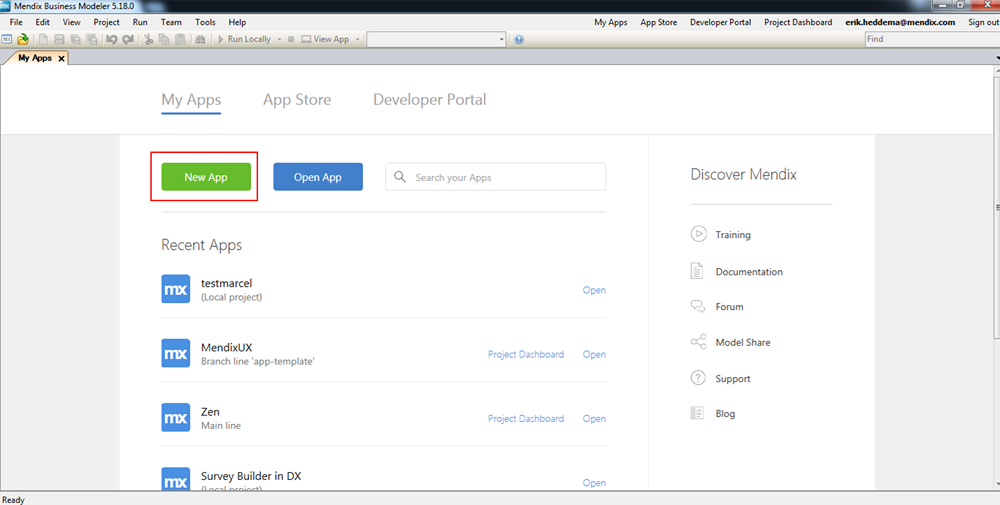
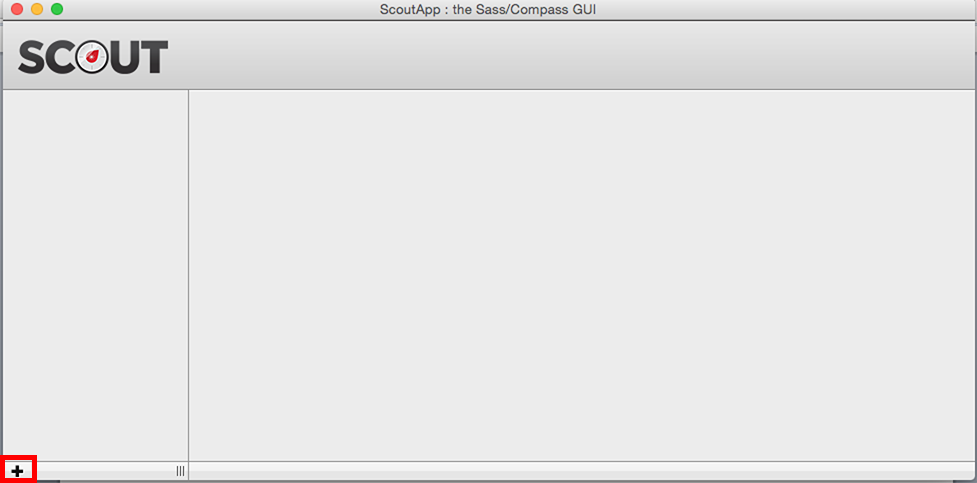
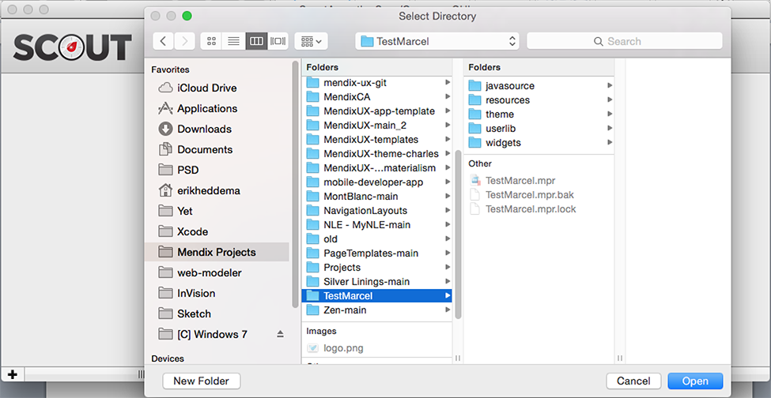
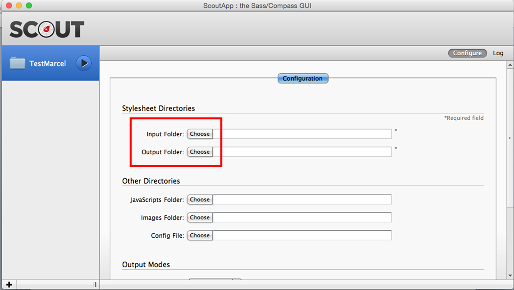
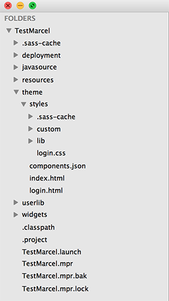
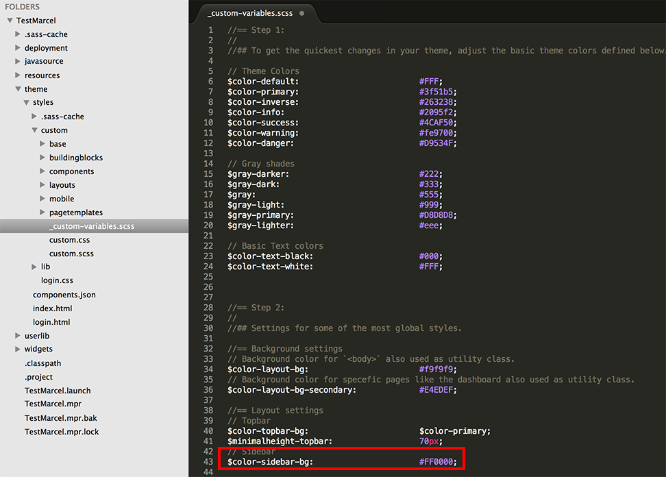
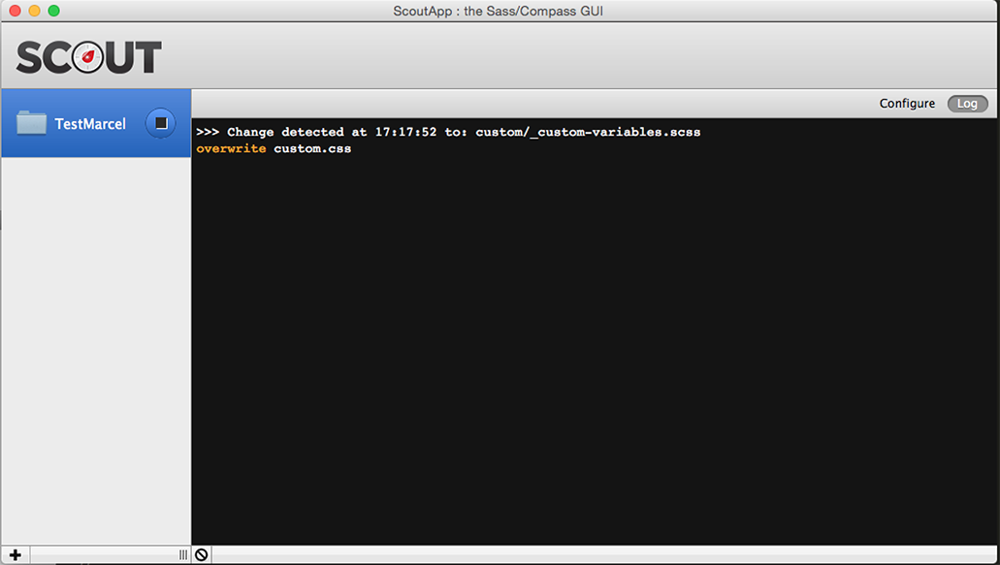
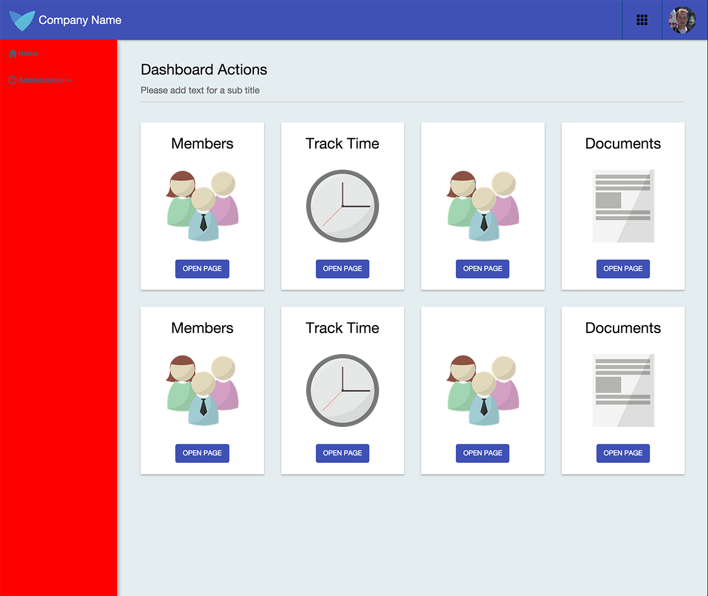

# Setup Mendix UI Framework

<table><thead><tr><th class="confluenceTh">Mendix Version</th><th class="confluenceTh">Create Date</th><th colspan="1" class="confluenceTh">Modified Date</th></tr></thead><tbody><tr><td class="confluenceTd">5</td><td class="confluenceTd">Aug 20, 2015 14:16</td><td colspan="1" class="confluenceTd">Sep 02, 2015 11:27</td></tr></tbody></table>

In this how-to we will go through how to setup the [Mendix UI Framework](https://ux.mendix.com/) with the program called Scout.

**After completing this how-to you will know:**

*   How to create a new App
*   How to setup Scout and the [Mendix UI Framework](https://ux.mendix.com/)
*   How to make your first styling changes

## 1. Preparation

Before you can start with this how-to, make sure you have completed the following prerequisites.

*   Download the latest [Mendix Business Modeler](https://appstore.mendix.com)
*   Download [Scout
    ](http://mhs.github.io/scout-app/)
*   Download text editor [Sublime Text](http://www.sublimetext.com/)

## 2\. Create a new App in the Mendix Business Modeler

In this chapter we will create a new app and select a theme from the New App selector.

1.  Open the **Mendix Business Modeler**.
2.  Create a **New App** from the **My Apps** screen in the Mendix Business Modeler.

     
3.  Select a theme for your app.

    
4.  You can now deploy your app or just head over to section 3 to configure Scout.

## 3\. Configure Scout

**Windows 10 users need to use the following workaround. Click [here](Scout+and+Windows+10+Workaround) for the workaround.**

The [Mendix UI Framework uses **SASS** and **Compass**, which rely on Ruby. However, you can install Scout to run Sass and Compass in a self-contained Ruby environment, letting you effortlessly manage all of your Sass projects with a handful of clicks. ](http://mhs.github.io/scout-app/)

1.  Open your **App Project Folder** in Scout by clicking on the plus button in the left sidebar all the way at the bottom.

    
2.  Select the **project directory** from your newly created App.

    
3.  Choose the **Input** and **Output** folder by clicking on **Choose**.

    
4.  Select the **styles** folder for your **Input** and **Output** folder.
    Input and Output path should be: C:\Mendix Projects\Mendix-App\theme\styles

     
5.  After selecting the Input and Output folder you can press **Play** in the left sidebar next to your Project Folder name.

    
    Scout is now set to compile the changes you want to make for your own or existing theme.

## 4\. Configure your text editor

1.  Open the **Project Directory** from your App in your desired text editor.

    
2.  The **theme **folder is where you can find the theme that was selected when creating a New App. The folder theme\styles\custom will be used to make our own changes. Let's change the background for our sidebar!
3.  Open up the file _<u>**custom-variables.scss**</u>.

     
    Let's take a look at **Step 2 **in the _<u>**custom-variables.scss **</u>file. As the comments suggest we can adjust the background-color for the sidebar. 
4.  Change the color from white (#FFF) to red (#FF0000).

    

5.  Now **save** the file and switch to Scout. You should now see a change in the **Log** tab. The log should say that the file custom.css has been overwritten. Scout compiles a CSS file from all your SASS files.

    

6.  Deploy (or redeploy) your app and see the change you made to the sidebar!

    

    As you can see our sidebar is now red, not the best look and feel but it works!

## 5\. Related content

*   [Scout and Windows 10 Workaround](/howto50/Scout+and+Windows+10+Workaround)
*   [Scout and Windows 10 Workaround](/howto6/Scout+and+Windows+10+Workaround)
*   [Filtering Data on an Overview Page](/howto50/Filtering+Data+on+an+Overview+Page)
*   [Layouts and Snippets](/howto50/Layouts+and+Snippets)
*   [Layouts and Snippets](/howto6/Layouts+and+Snippets)
*   [Filtering Data on an Overview Page](/howto6/Filtering+Data+on+an+Overview+Page)
*   [Setup Mendix UI Framework with just CSS](/howto50/Setup+Mendix+UI+Framework+with+just+CSS)
*   [Setting Up the Navigation Structure](/howto50/Setting+Up+the+Navigation+Structure)
*   [Creating your first two Overview and Detail pages](/howto50/Creating+your+first+two+Overview+and+Detail+pages)
*   [Setup Mendix UI Framework](/howto50/Setup+Mendix+UI+Framework)

