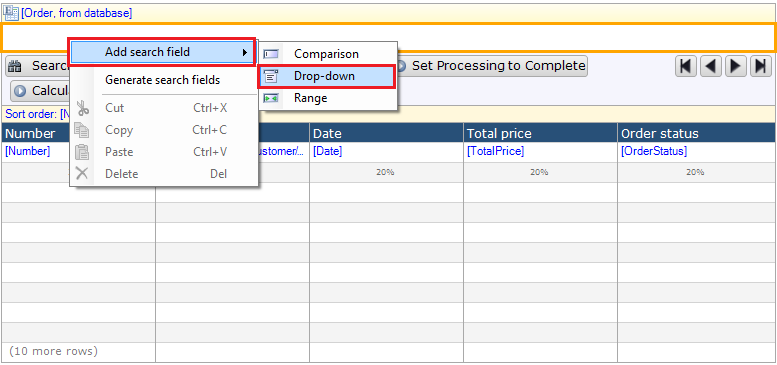
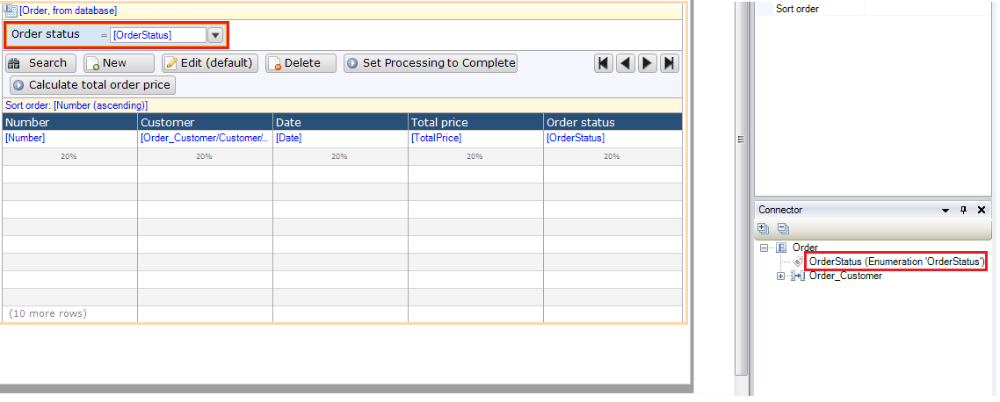
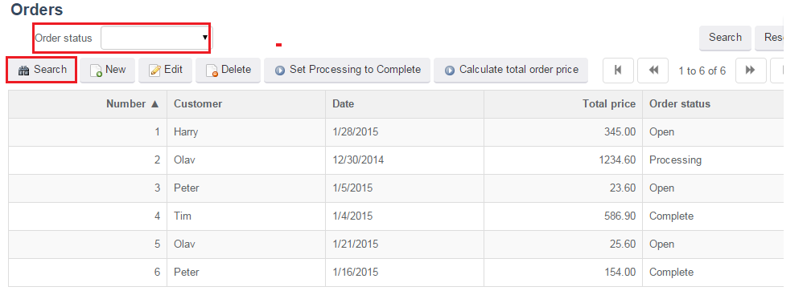
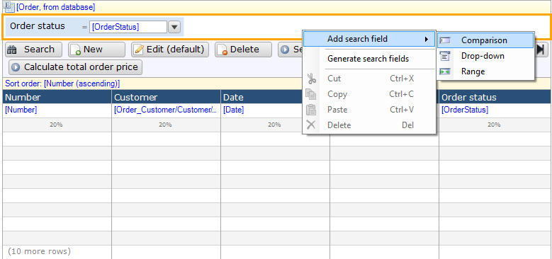
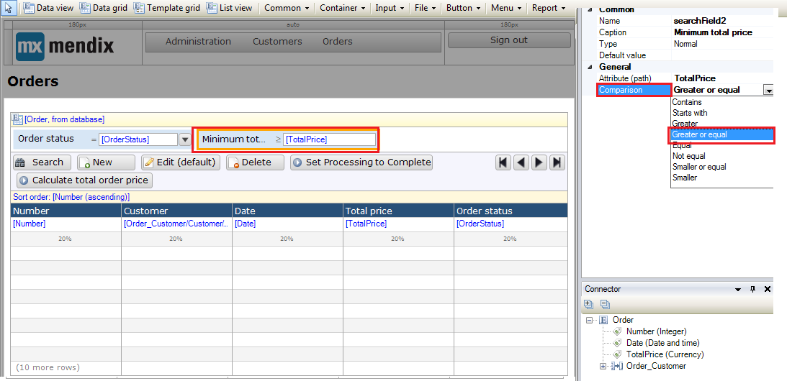
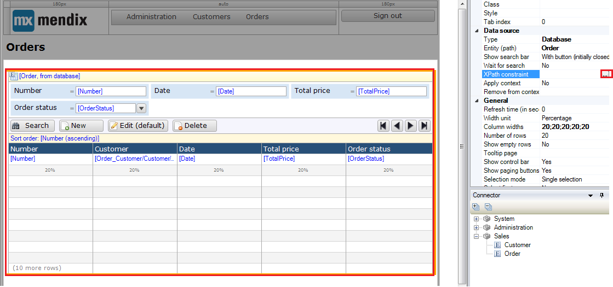
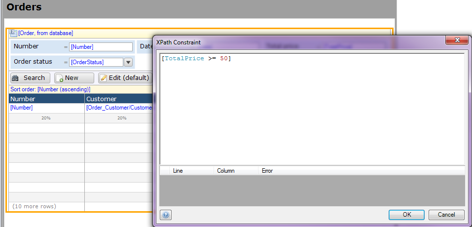
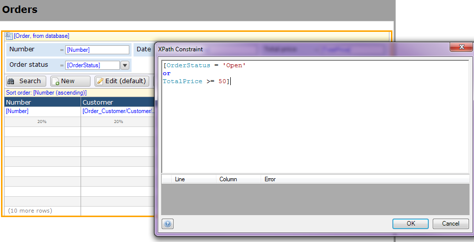
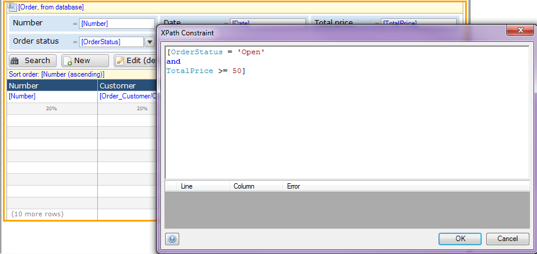
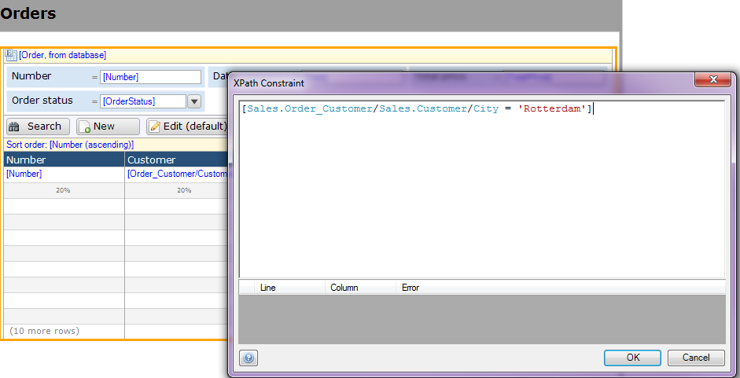

<table><thead><tr><th class="confluenceTh">Mendix Version</th><th class="confluenceTh">Create Date</th><th colspan="1" class="confluenceTh">Modified Date</th></tr></thead><tbody><tr><td class="confluenceTd">5</td><td class="confluenceTd">Jan 20, 2015 10:56</td><td colspan="1" class="confluenceTd">Sep 02, 2015 11:23</td></tr></tbody></table>

To filter data on your page you can use the search bar functionality or you can add an XPath constraint to your data grid. The search bar contains search fields that allow the end-user to quickly find the information he or she needs. XPath is a hard coded constraint on your data grid to filter data. The how-to will start with preparing a data structure and some example data. After this set up you will filter your data with a search bar, followed by filtering your data using different XPath constraints.  

## 1\. Preparing the Data Structure, GUI and Example Data

To see the results of this how-to it is necessary that you setup a test project with test data.

Before you continue, make sure that you know how to create:

*   **Domain models**, if you need more info, take a look at this [how-to](Creating+a+basic+data+layer).
*   **Overview and detail pages**, if you need more info, take a look at this [how-to](Creating+your+first+two+Overview+and+Detail+pages).
*   **Menu items**, if you need more info, take a look at this [how-to](Setting+Up+the+Navigation+Structure).

1.  Create the following domain model:
    
2.  Create **overview** and **detail** pages to manage objects of type **Customer** and **Order**.
3.  Create **menu items** to access the **Order** and the **Customer** overview pages.
4.  Add the following customer data to your app:
    
5.  Add the following order data to your app:
    

## 2\. Filter a List of Orders Using the Search Bar

In the previous section you set up a basic data structure and created some sample data. In this section you will add search fields to the search bar to allow the user to filter data on your overview page. In the examples you will filter on the order status and on a minimum price.

1.  Open your **orders overview** and right click on the (empty) section above the **Search **button.

    


    The search bar section might be already populated if you automatically filled the contents of your data grid.

    

    

2.  Right click on the search bar section and select **Drop-down**.
    

3.  Add the **OrderStatus** attribute to the search field and define the name.
    

4.  Redeploy your application and click on the **Search** button on your orders overview. The new search field appears.
    

5.  Use the **Order status** search field to filter your list on a specific order status and click the 'Search' button on the right side.
    

6.  To filter on a minimum price, add another search field to your orders overview of type **Comparison**.
    

7.  Select the **TotalPrice** attribute, name the search field **Minimum total price** and change the **Comparison** from **Contains** to **Greater or equal.**
    

8.  Redeploy your application and enter 50 in your newly added search field. Your list will be filtered to only show orders with a minimum value of 50.
    

## 3\. Filtering a List of Orders on Status 'Open' Using XPath 

In the previous section you used the search bar to filter data on your overview page. Now you will add an XPath constraint on the Orders data grid. With an XPath constraint on a data grid you can (hard coded) filter the objects shown in the list. Mendix XPath is one of the Mendix query languages designed to retrieve data. XPath uses path expressions to select data of Mendix objects and their attributes or associations. To learn more about XPath take a look at this [documentation](/refguide5/XPath+Constraints?utm_source=businessmodeler&utm_medium=software&utm_campaign=modeler). In this section you will constrain the data grid so it will only display orders with status 'Open'.

1.  **Select** the **Order data grid** and click the **XPath constraint** field at the **Properties** section on the right.
    
2.  Enter the following expression in the XPath Constraint window: _[OrderStatus = 'Open']_. The data grid will now only show orders with status 'Open'.
    
3.  Run your application to see the following result set:
    

## 4\. Filtering a List of Orders on Minimum Total Price Using XPath

In the previous section you have constraint the data grid on status 'Open'. In this section we will change the constraint to ensure that the data grid will only show orders with a minimum value of 50.00.

1.  **Select** the **Order** **data grid** and Open the **XPath constraint** field at the **Properties** section again and enter the following expression: _[TotalPrice >= 50]_.
     
2.  If you run your application you will see the following result set.
    

## 5\. Combining Constraints Using XPath

In the previous two sections you used single constraints to filter the data grid on status and minimum total price. In this section you will combine those two constraints. Combination can be made with logical operator **AND** and **OR**.  

1.  To constrain the results in the order overview to only the 'Open' orders _**or**_ of a minimum price of a 50.00, you have to insert an _OR_ statement to the XPath in the 'XPath Contraint' box:
    _[OrderStatus = 'Open']_
    _or_
    _[TotalPrice >= 50]_
    
2.  Run your application to see all the orders with the order status 'Open' or with a total price higher or equal to 50.
    
3.  To constrain the results in the order overview to only orders which are 'Open' _**and**_ have a minimum total price of 50, add an 'and' statement to the XPath in the 'XPath Contraint' box.
    _[OrderStatus = 'Open']_
    _and_
    _[TotalPrice >= 50]_
    
4.  Run your application to see orders which are 'Open' and have a minimum total price of 50.
    

## 6\. Filter Order List on Attributes of Associated Customers Using XPath

In the previous section you have constrained the data grid on attributes of the same entity as the data grid entity. In this section you will constrain on attributes over an associated object. In the example of this section you will filter the orders by their associated customers based on the city letter of the customer. 

1.  To constrain the results in the order overview to only the orders from customers in Rotterdam enter the following XPath into the 'XPath Contraint' box:
    _[Sales.Order_Customer/Sales.Customer/City = 'Rotterdam']_
    
2.  Run your application to only see the orders of customers in Rotterdam.
    

## 7\. Related content

*   [Scout and Windows 10 Workaround](/howto50/Scout+and+Windows+10+Workaround)
*   [Scout and Windows 10 Workaround](/howto6/Scout+and+Windows+10+Workaround)
*   [Filtering Data on an Overview Page](/howto50/Filtering+Data+on+an+Overview+Page)
*   [Layouts and Snippets](/howto50/Layouts+and+Snippets)
*   [Layouts and Snippets](/howto6/Layouts+and+Snippets)
*   [Filtering Data on an Overview Page](/howto6/Filtering+Data+on+an+Overview+Page)
*   [Setup Mendix UI Framework with just CSS](/howto50/Setup+Mendix+UI+Framework+with+just+CSS)
*   [Setting Up the Navigation Structure](/howto50/Setting+Up+the+Navigation+Structure)
*   [Creating your first two Overview and Detail pages](/howto50/Creating+your+first+two+Overview+and+Detail+pages)
*   [Setup Mendix UI Framework](/howto50/Setup+Mendix+UI+Framework)

*   [XPath Constraints](/refguide5/XPath+Constraints)