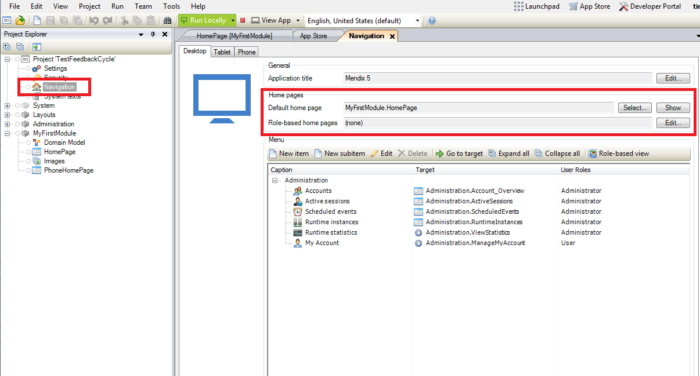
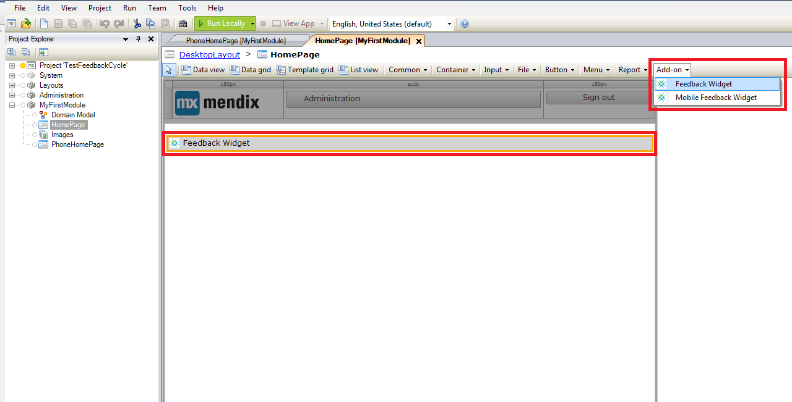
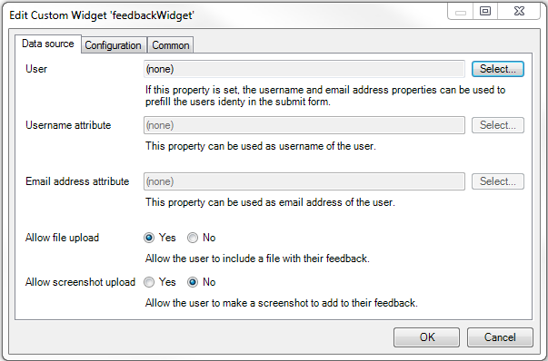
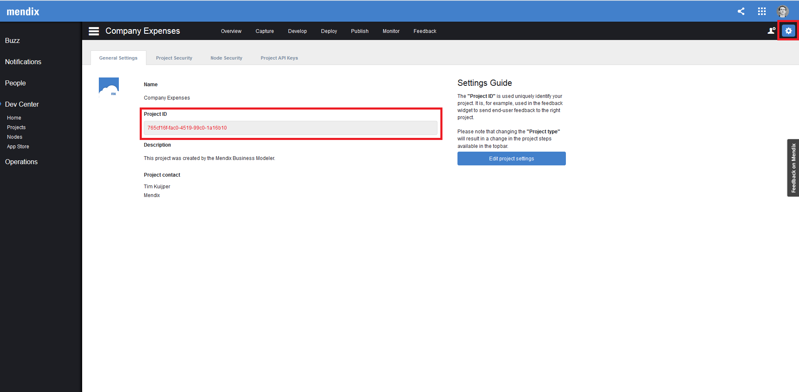
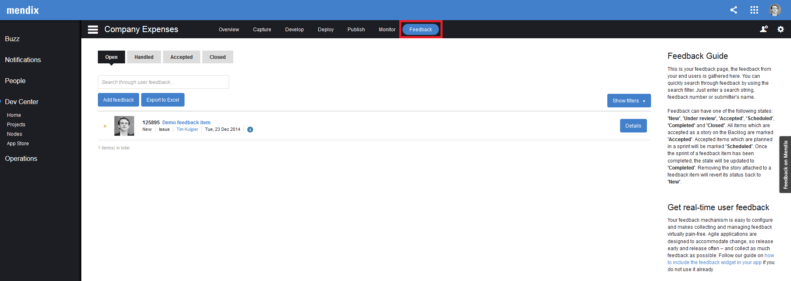
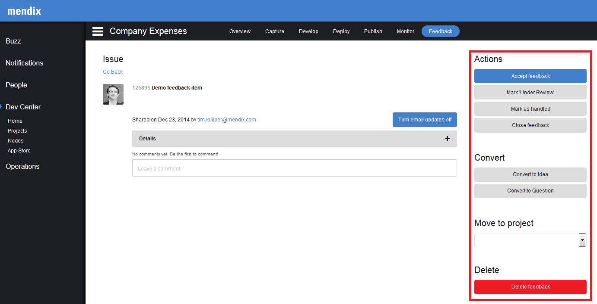
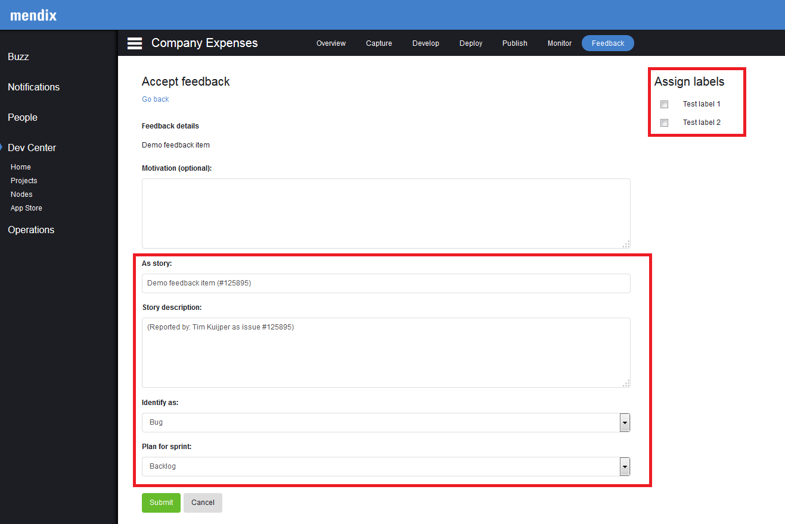

<table><thead><tr><th class="confluenceTh">Mendix Version</th><th class="confluenceTh">Create Date</th><th colspan="1" class="confluenceTh">Modified Date</th></tr></thead><tbody><tr><td class="confluenceTd">5.10</td><td class="confluenceTd">Nov 26, 2014 14:49</td><td colspan="1" class="confluenceTd">Oct 19, 2015 11:54</td></tr></tbody></table>

With Mendix, you can make use of fully integrated feedback cycle functionality. Gathering feedback, evaluating the feedback and converting valid feedback into actionable userstories is supported by Mendix out of the box. In this document the entire process is explained in detail, aiming to enable developers to capture and process valuable user feedback.

# Table of contents

## 1\. Prerequisites

Before you can start gathering feedback, the following prerequisites have to be in place:

1.  A project containing a working application model

### 1.1 Ensure that the Mendix feedback widget is included in your project

The feedback widget is automatically included in any new project that you create. If you are working in an older Mendix project, the first step would be to ensure you have the latest version of the Mendix Feedback Widget included in your project.

1.  Download the latest version of the Mendix Feedback Widget from the Mendix App Store.
    Once the latest Mendix Feedback Widget is included in you project, we need to ensure that the widget is added to the homepage of your application.
2.  Open your homepage from your project navigation
    
3.  If the Feedback Widget is not added to the page, please add the widget to the page or layout by selecting the Feedback Widget under 'Add-on' and dropping the widget on any position of the document
    

## 2\. Configure the widget

The next step would be to configure the widget.

1.  The preferences of the widget can be opened by double clicking on the widget that is placed on a page. 
2.  Select the 'User' entity that is used in your application to store the name and emailaddress of the user. Please note that this object must be a specialisation of the 'User' entitiy within the 'System' module (for instance: 'Account' in the 'Administration' module). 
    
3.  Select the username attribute that stores the name of the user and the email address attribute. This will be used to automatically fill the name and email address of the user that is logged in when submitting feedback within your application (see the example below).
    
4.  Decide whether you want to allow users to add a file to the feedback item and whether you want to allow the inclusion of a screenshot of the page. 
5.  Open the 'Configuration' tab of the preferences of the feedback widget.
6.  Ensure that the feedback server is set to '<a rel="nofollow">https://sprintr.home.mendix.com/'</a> 
7.  Ensure that the project identifier is filled correctly. This is automatically done for the widget that is included in the default homepage of your application. If necessary you can find the identifier of your project by clicking on the settings link in the top right of your project within the Mendix Developer Portal. 
    
8.  If you have configured multiple homepages for different user roles, you need to add the Mendix Feedback Widget to each homepage for the user role that you wish to gather feedback from. This can easily be done by copying the configured widget to the other relevant layouts and/or pages.

## 3\. Gathering feedback

When a version of the application containing the Mendix Feedback Widget that has been configured and added to all homepages is deployed, we can start gathering feedback. 

## 4\. Receive feedback

When a user is logged into the application a feedback button will appear on the right hand side of the screen.

1.  Click the feedback button and a popup will be opened that allows the user to enter feedback.
    

## 5\. Process feedback

Once you have received feedback, you and your team can process the feedback within the Mendix Developer Portal. 

1.  Open your project in the Mendix Developer Portal
2.  Open the tab 'Feedback'
    
3.  Click on the title of the feedback item to open the details of that item
4.  Process the item by commenting on the item (e.g. to ask for clarification) or choosing one of the actions displayed in the menu bar on the right
    

**Options:**

<table><thead><tr><td class="confluenceTd"><em><em>Accep</em>t feedback</em></td><td class="confluenceTd">This feedback is valid and I want to add a story to my backlog on the basis of this item</td></tr></thead><tbody><tr><td class="confluenceTd"><em>Mark 'Under review'</em></td><td class="confluenceTd">Notify the person that submitted the feedback and your team that the item is under review</td></tr><tr><td class="confluenceTd"><em>Mark as 'Handled'</em></td><td class="confluenceTd">Change the status of the item from open to handled, so that the item will not pollute your open item list</td></tr><tr><td class="confluenceTd"><em>Close feedback</em></td><td class="confluenceTd">Close the feedback (e.g. when the item is already solved, a duplicate already has been accepted, etc.)</td></tr><tr><td class="confluenceTd"><em>Convert to idea</em></td><td class="confluenceTd">Change the feedback type to an idea</td></tr><tr><td class="confluenceTd"><em>Convert to question</em></td><td class="confluenceTd">Change the feedback type to 'question'</td></tr><tr><td class="confluenceTd"><em>Move to project</em></td><td class="confluenceTd">Move the item to another project that you have access to</td></tr></tbody></table>

## 6\. Add a feedback story on your backlog

After clicking the 'Accept feedback' button only a small steps need to be taken to create a story on the basis of the feedback item to your backlog. 

1.  Fill in a logical name of the userstory and description
2.  Decide whether the feedback item should be classified as a bug or feature
3.  Select the sprint / backlog that you want to add the story to
4.  Select any label that you want to add to that story
    

## 7\. Feedback to the user

Once a feedback item is connected to a userstory, Mendix will automatically update the person that submitted the story on the progress made on that story. 

1.  Adding a story that has feedback attached from your backlog to a sprint will result in a message that the item has been planned.
2.  Completing a sprint containing a story that has feedback attached will result in a message that the item has been completed.

## 8\. Conclusion

In a few simple steps, Mendix enables you to start collecting feedback from your users. Once feedback has been collected it can be easily processed and transferred into actionable items on your backlog. To complete the cycle, the user will be updated on the progress made on the processing of this feedback item automatically.

## 9\. Related content

*   [Managing your Application Requirements with Mendix](/howto50/Managing+your+Application+Requirements+with+Mendix)
*   [Managing your Application Requirements with Mendix](/howto6/Managing+your+Application+Requirements+with+Mendix)
*   [Starting your own repository](/howto50/Starting+your+own+repository)
*   [Contributing to a GitHub repository](/howto50/Contributing+to+a+GitHub+repository)
*   [Contributing to a GitHub repository](/howto6/Contributing+to+a+GitHub+repository)
*   [Starting your own repository](/howto6/Starting+your+own+repository)
*   [Using Team Server - Version Control](/howto50/Using+Team+Server+-+Version+Control)
*   [Gathering user feedback](/howto50/Gathering+user+feedback)
*   [Using Team Server - Version Control](/howto6/Using+Team+Server+-+Version+Control)
*   [Gathering user feedback](/howto6/Gathering+user+feedback)

