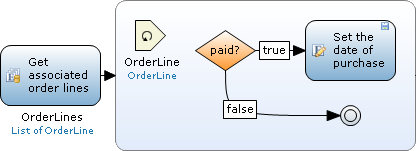

A continue event is used to stop the current iteration and start the iteration of the next object. Please note that continue events can only be used inside [loops](Loop).



Only if the last activity of the flow inside the loop ends with a break event, the loop will be aborted. Otherwise, the iteration of the next object will be started automatically. So, in theory, a continue event is only necessary after a split (when one of the paths does not have a destination yet), as both paths of a split need a destination. However, for clarity you could choose to always include one.





Let us say you have a list of objects of the entity 'OrderLine' and you want to set the purchase date for only the paid order lines. This can be done using a loop with an exclusive split, a continue event and a change activity. The exclusive split determines whether the order line is paid or not. If the order line is paid the purchase date is set by a change activity and the looped activity starts with the next order line. If the order line is not paid the loop starts with the next order line because of the continue event.


